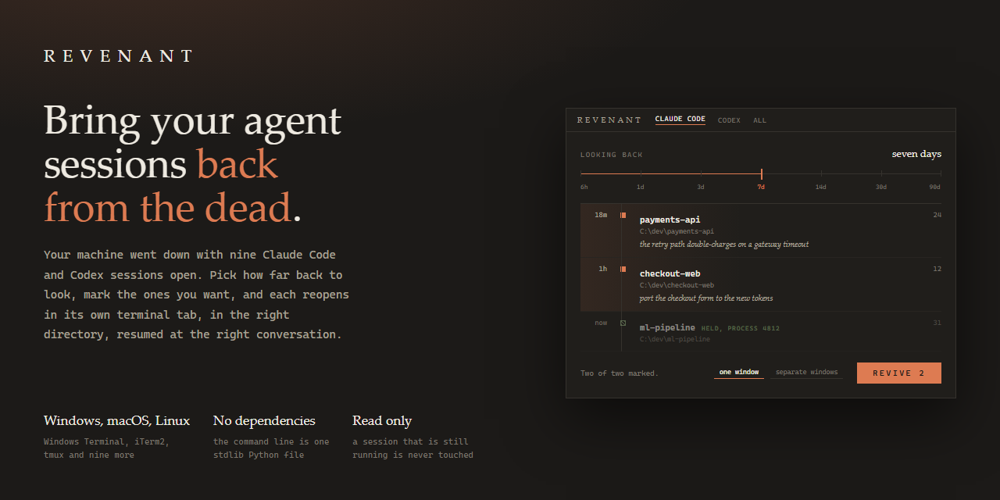
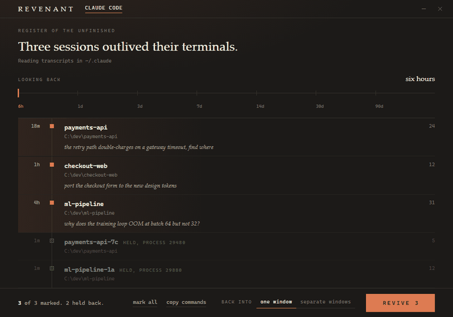
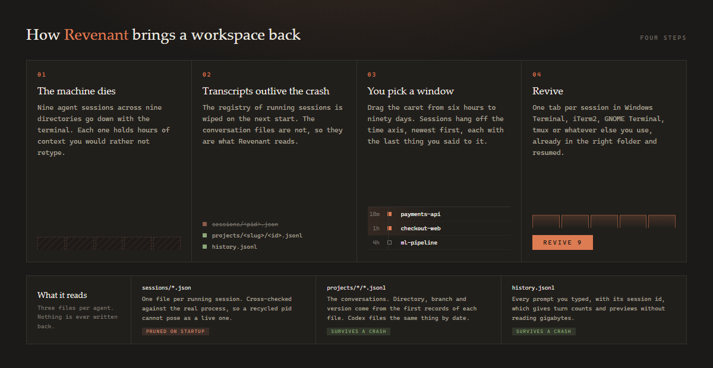

<div align="center">



<br>

[](https://github.com/DonPlaton/revenant/actions/workflows/tests.yml)
[](LICENSE)
[](https://www.python.org/)
[](pyproject.toml)

**Your machine crashed with nine agent sessions open. Get them all back in one click.**

</div>

---

## The problem

After a crash you do not want a conversation back. You want the nine you had open.

Claude Code can find them: `Ctrl+A` in its picker widens the list to every project on the machine.
What it will not do is bring them back together. It restores one session into the terminal you are
standing in, and when that session belongs to another project it copies a `cd` and a resume command
to your clipboard for you to paste yourself. Nine sessions is nine trips through that, in nine
terminals you open by hand. Codex has no picker that spans directories at all.

Revenant lists every session that was active in a window you choose, across every directory and
both agents, and opens the ones you pick: each in its own tab, already in its own directory,
already resumed.

<div align="center">



<sub>Drag the caret from six hours to ninety days. Sessions hang off the time axis, newest first.
A session that is still running is hatched and held back. Then hit REVIVE.</sub>

</div>

## Quick start

One line, and you have the app.

**Windows**, in PowerShell:

```powershell
irm https://raw.githubusercontent.com/DonPlaton/revenant/main/install.ps1 | iex
```

**macOS and Linux**, in a terminal:

```bash
curl -fsSL https://raw.githubusercontent.com/DonPlaton/revenant/main/install.sh | bash
```

The installer downloads the app, checks you have a Python it can use, and leaves you a launcher:

| | you get | it lives in |
|---|---|---|
| Windows | Desktop and Start Menu shortcuts | `%LOCALAPPDATA%\Programs\Revenant` |
| macOS | `Revenant.app`, with an icon | `~/Applications`, code in `~/.local/share/revenant` |
| Linux | an entry in your application menu | `~/.local/share/revenant` |

Nothing runs in the background, nothing starts at login, and no PATH is changed unless you ask.

<details>
<summary><b>Without piping the internet into a shell</b></summary>

Fair. Download the repository as a zip, or clone it, then:

- **Windows**: double-click **Install Revenant.cmd**.
- **macOS**: double-click **Install Revenant.command**. A zip download loses the executable bit,
  so if nothing happens, run `chmod +x "Install Revenant.command"` once.
- **Linux**: `./install.sh`

Both scripts behave the same either way. Run from a clone they point the launcher at that folder
and copy nothing, which is what you want while you are working on it.

</details>

<details>
<summary><b>Options, requirements and removing it</b></summary>

Revenant needs **Python 3.10 or newer**. The installer looks for one, ignores the Microsoft Store
stub that pretends to be `python.exe`, and tells you how to get a real one if there is none. On
Windows, adding `-InstallPython` lets it fetch Python through winget instead of stopping.

`--native-window` (`-NativeWindow` on Windows) also installs
[pywebview](https://pywebview.flowrl.com/), so the app opens in its own frameless window instead
of a chromeless Chrome or Edge window. If it will not install, the app still works.

To pass a flag through the one-liner:

```powershell
& ([scriptblock]::Create((irm https://raw.githubusercontent.com/DonPlaton/revenant/main/install.ps1))) -NativeWindow -Cli
```

```bash
curl -fsSL https://raw.githubusercontent.com/DonPlaton/revenant/main/install.sh | bash -s -- --native-window --cli
```

`--cli` puts `revenant` on your PATH. `--ref v1.2.0` (`-Ref` on Windows) installs a specific
version rather than the current main.

To remove it: **Uninstall Revenant.cmd**, `.\uninstall.ps1`, or `./uninstall.sh`. They take back
the shortcuts, the PATH entry and the downloaded copy. A clone is never touched.

</details>

### As a command line tool

```bash
pip install -e .          # then: revenant --since 7d
```

Or just run the file. It imports nothing outside the standard library, which matters on a machine
you have only just rebooted:

```bash
python revenant.py --since 7d
```

## Using it

The app has two controls: a caret for how far back to look, and REVIVE. Click a row to mark or
unmark it, double click it (or press `O` with it focused) to open its folder. `Enter` revives what
is marked, `Ctrl+R` rescans, `Esc` closes. Everything is reachable from the keyboard.

The command line does the same and more:

```bash
revenant                        # what was alive in the last 24 hours
revenant --since 7d --pick      # choose from the last week: 1,3,5 or 2-4 or all
revenant --since 6h --launch    # reopen each in its own terminal tab
revenant --all-agents           # every agent installed on this machine
revenant --print                # paste-ready cd and resume command pairs
revenant --emit revive.sh       # a launcher script you can rerun any time
revenant gui                    # open the desktop app
revenant agents                 # what is installed, and where it keeps things
revenant terminals              # where sessions can open here
```

<details>
<summary><b>All flags</b></summary>

Choosing sessions:

| flag | effect |
|---|---|
| `--since 24h` | window start: `30s`, `90m`, `24h`, `7d`, `2w`, `today`, `all`, `2026-09-01`, `2026-09-01T10:30` (default `24h`) |
| `--until <time>` | window end, same formats |
| `--agent <key>` | `claude-code` or `codex` |
| `--all-agents` | scan every agent installed here and merge the results |
| `--dir <text>` | only sessions whose path contains this, repeatable |
| `--slug <text>` | only one transcript folder |
| `--latest-per-dir` | keep just the newest session per directory |
| `--min-turns N` | skip sessions with fewer real prompts (default `1`, so `/model`-only sessions vanish) |
| `--limit N` | cap the list (default `40`, `0` for no limit) |
| `--include-live` / `--only-live` | show sessions that may still be running |
| `--from-snapshot` | restore exactly the set recorded by `revenant snapshot` |
| `--root <path>` | read a config directory somewhere else |

Acting on them:

| flag | effect |
|---|---|
| *(none)* | print the table |
| `--print` | `cd` and resume pairs, ready to paste |
| `--emit FILE` | write a launcher script; `.ps1`, `.sh` and `.cmd` pick their own syntax |
| `--launch` | open the sessions now |
| `--terminal <key>` | where to open them, from `revenant terminals` |
| `--pick` | choose interactively before acting |
| `--dry-run` | with `--launch`, print the commands instead of running them |
| `--json` | machine-readable output |
| `--window`, `--profile` | target a specific Windows Terminal window or profile |

</details>

## Where sessions reopen

Revenant picks the best terminal it can find, and `--terminal` overrides it. Being inside tmux
wins over everything, which is what you want over SSH.

| platform | tabs in one window | one window each |
|---|---|---|
| Windows | Windows Terminal, tmux | the console |
| macOS | iTerm2, tmux | Terminal.app, kitty, WezTerm, Ghostty, Alacritty |
| Linux | GNOME Terminal, Konsole, Xfce Terminal, tmux | kitty, WezTerm, Ghostty, Alacritty, foot, xterm |

Windows Terminal can be installed, look available, and still refuse to run, because it is a Store
alias inside a folder some shells are denied access to. Revenant notices and moves to the next
terminal on the list rather than failing.

## Agents

| agent | transcripts | how a live session is spotted |
|---|---|---|
| Claude Code | `~/.claude/projects/<slug>/<uuid>.jsonl` | it registers itself, so this is exact |
| Codex | `~/.codex/sessions/<date>/rollout-*.jsonl` | no registry, so anything touched in the last two minutes is held back |

Each row is labelled with the name the agent itself uses: what you set with `/rename`, or the title
it generated from your first prompt. That is usually the difference between reading `continue` and
reading `Fix the retry loop in the payment worker`.

Sessions you start from the integrated terminal in VS Code, Cursor or Windsurf are ordinary CLI
sessions, so they are found and revived like any other. Chat panels built into those editors keep
their history in the editor's own database and expose no way to resume one, so Revenant does not
pretend to handle them.

Claude Code's own picker hides sessions started with `-p`, with the SDK, or with `/loop`. Revenant
lists them, because after a crash you may well want one of those back.

Adding another agent means one subclass in `revenant_agents.py` and one line in the registry. See
[CONTRIBUTING.md](CONTRIBUTING.md).

## How it works

<div align="center">

</div>

The registry of running sessions is pruned when the agent next starts, so after a crash it is
empty. That is why tools built on a snapshot daemon lose everything when the daemon was not
running. Revenant reads the transcripts, which are always there, and uses the registry only to
work out what is alive right now.

## What it costs

Measured on 34 transcripts totalling 534 MB, on an eight core desktop:

| | |
|---|---|
| scan a seven day window | 40 ms, plus 12 ms to read the names of the rows it kept |
| scan everything on disk | 52 ms, plus 20 ms |
| repeat request in the app | 0.2 ms, served from an eight second cache |
| peak Python heap for a full scan | 1.5 MB |
| the app while you look at it | 0.3% of one core |

Liveness used to cost half a second because it shelled out to `tasklist` and walked all 428
processes on the machine. It now asks the kernel about the handful of process ids in the registry,
which takes 0.2 ms.

The desktop window is a WebView2 or WebKit surface, so it holds around 430 MB while it is open,
the same as any browser-backed app. It is meant to be opened, used for ten seconds and closed, and
it takes its processes with it. Nothing stays resident: no tray icon, no service, no autostart. If
you want the light path, the command line does the same work in 40 ms and about 15 MB.

## Safety

Revenant is read only with respect to your agents. It never writes to, signals, or kills a
session, and a test asserts that a full run leaves every file under `~/.claude` unchanged to the
byte.

A session whose process is alive is held back, and `--launch` refuses it outright, because two
processes writing one transcript corrupt it. The check compares the process id against the real
executable name, so a recycled id cannot pose as a live session, and it errs one way on purpose:
a process it cannot read, a binary an installer renamed mid-update, a name the kernel truncated,
all count as the agent and keep the session off the list. Being wrong that way costs you a row.
Being wrong the other way costs you a transcript. Codex keeps no registry, so a rollout file
touched in the last two minutes is treated as possibly open.

The desktop backend binds to `127.0.0.1` on an ephemeral port, mints a token at startup and
requires it on every request, rejects any request whose `Host` header is not that exact address,
refuses path traversal out of `ui/`, and stops when the window goes quiet. The interface loads no
remote fonts, scripts or styles, so it works with the network off.

## How it compares

Two different things get called a session manager.

**Managing the sessions you are running.** [ccmanager](https://github.com/kbwo/ccmanager),
[agent-deck](https://github.com/asheshgoplani/agent-deck) and
[myrlin-workbook](https://github.com/therealarthur/myrlin-workbook) run and switch between live
sessions across worktrees; [agent-manager-x](https://github.com/maddada/agent-manager-x) and
[Aeroric](https://github.com/Aho1ic/Aeroric) watch them from a desktop app. These are good tools
and Revenant does not replace them. They also die with the machine, which is when Revenant starts.

**Bringing them back afterwards.** That is this category, and almost all of it works by snapshot:
a scheduled task records which sessions are open every couple of minutes, and restore replays the
last record. It works, until the crash happens on a machine where the daemon was not installed
yet, or had not run since you opened the sessions that matter.

| | platform | interface | needs a daemon first | agents |
|---|---|---|---|---|
| **Revenant** | **Windows, macOS, Linux** | **desktop app** and CLI | **no** | Claude Code, Codex |
| [ai-session-manager](https://github.com/daniel-farina/ai-session-manager) | macOS, Linux | web app, copies a command | no | **9** |
| [SnowSky1/claude-session-restore](https://github.com/SnowSky1/claude-session-restore) | Windows | desktop shortcut | yes, every 2 min | Claude Code |
| [Supersynergy/claude-session-restore](https://github.com/Supersynergy/claude-session-restore) | macOS, some Linux | CLI and MCP | yes | Claude Code |
| [Livshitz/claude-revive](https://github.com/Livshitz/claude-revive) | macOS | TUI picker | no | Claude Code |
| [asadtariq96/cc-session-restore](https://github.com/asadtariq96/cc-session-restore) | macOS with iTerm2 | CLI and a LaunchAgent | yes | Claude Code |
| [Mahrkeenerh/ClaudeRestore](https://github.com/Mahrkeenerh/ClaudeRestore) | Linux | CLI | yes | Claude Code |
| [oviron/claude-session-widget](https://github.com/oviron/claude-session-widget) | macOS | menu-bar app | yes | Claude Code |
| [cookiecad/tmux-claude-resurrect](https://github.com/cookiecad/tmux-claude-resurrect) | tmux | plugin | tmux-resurrect | Claude Code |
| [STRML/cmux-restore](https://github.com/STRML/cmux-restore) | cmux | CLI | yes | Claude Code |

Revenant needs nothing installed before the crash, because it reads the transcripts the agent
already wrote. Install it afterwards and it still finds everything.

Pick something else if you live in tmux, if you want a monitor for running agents, or if you use
one of the seven agents Revenant does not read yet. `ai-session-manager` is the closest neighbour:
it reads nine agents and hands you a command to paste, where Revenant reads two and opens the
terminals itself, on Windows too.

## Development

```bash
python -m pytest tests -q
```

189 tests, no network, no real session touched. Everything runs against a synthetic config
directory in `tmp_path`. They cover both agents' file formats, session naming, live process
detection and id reuse, the refusal to relaunch a running session, the argv of all fourteen
terminal backends on all three platforms, quoting of paths with spaces and apostrophes, corrupt
and truncated transcripts, the desktop backend's token, host and traversal guards, and the read
only guarantee.

Regenerate the images after changing the interface:

```bash
python assets/src/build.py
```

The demo recording runs against a synthetic config directory, so no real path or prompt ends up in
the repository.

## Design

The interface was drawn as a
[design canvas](https://claude.ai/code/artifact/8880a686-799e-4516-991a-f074c1511c59) before it was
built: sessions as marks on a time axis rather than a stack of cards, one decisive action, and
motion that reads as mechanical rather than decorative. The canvas uses Spectral and IBM Plex Mono.
The app ships with metrically similar system faces instead, so it never asks the network for a
font.

## License

MIT. See [LICENSE](LICENSE).
