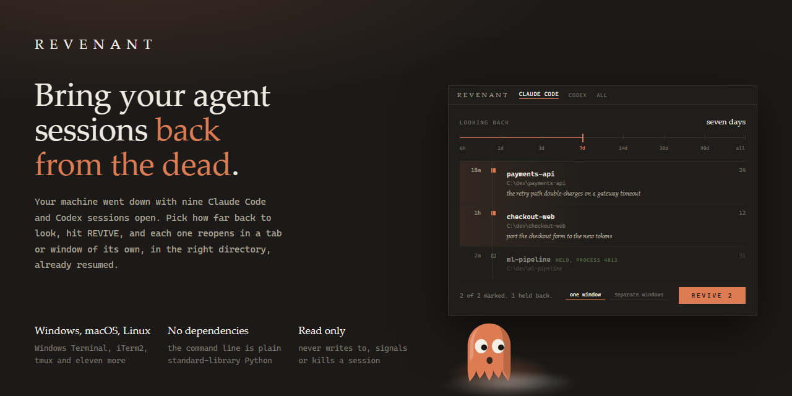
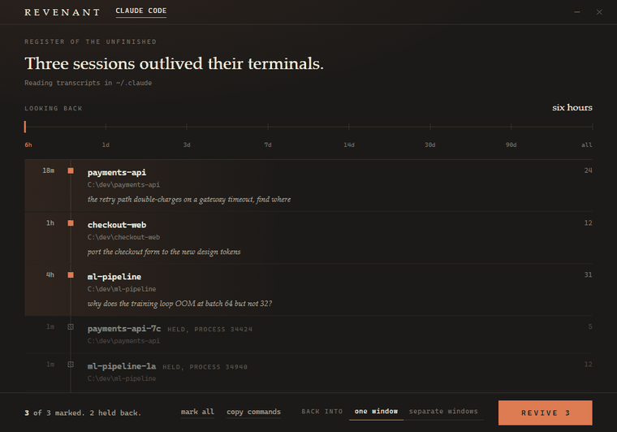
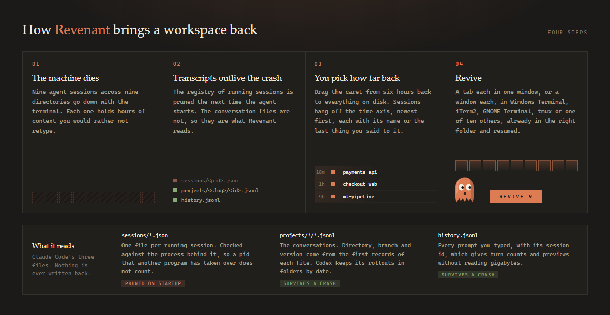
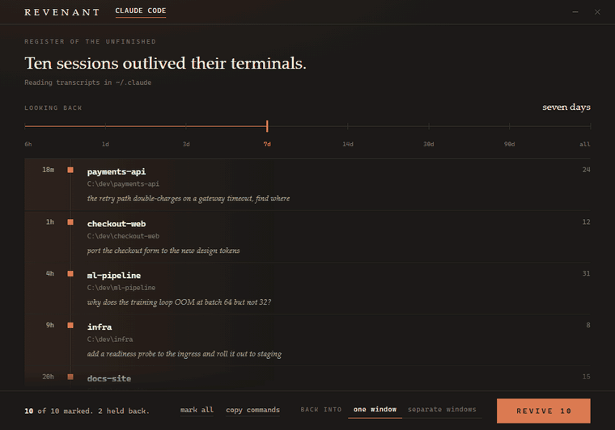

<div align="center">



<br>

[](https://github.com/DonPlaton/revenant/actions/workflows/tests.yml)
[](LICENSE)
[](https://www.python.org/)
[](pyproject.toml)

**Your machine crashed with nine agent sessions open. Get them all back in one click.**

</div>

---

## The problem

After a crash you do not want a conversation back. You want the nine you had open.

Claude Code can find them: `Ctrl+A` in its picker widens the list to every project on the machine.
What it will not do is bring them back together. It restores one session into the terminal you are
standing in, and when that session belongs to another project it copies a `cd` and a resume command
to your clipboard for you to paste yourself. Nine sessions is nine trips through that, in nine
terminals you open by hand. Codex has no picker that spans directories at all.

Revenant lists every session that was active in a time range you choose, across every directory
and both agents, and opens the ones you pick: each in a tab of one terminal window, or in a window
of its own if you prefer, already in its own directory, already resumed.

<div align="center">



<sub>Drag the caret along the time ruler from six hours back to three months. Sessions hang off the
time axis, newest first. A session that is still running is hatched and held back. Then hit
REVIVE.</sub>

</div>

## Quick start

One line, and you have the app.

**Windows**, in PowerShell:

```powershell
irm https://raw.githubusercontent.com/DonPlaton/revenant/main/install.ps1 | iex
```

Or, without a terminal: download
[**Install-Revenant.cmd**](https://github.com/DonPlaton/revenant/releases/latest/download/Install-Revenant.cmd)
and double-click it. It runs the same installer. Your browser and Windows may each ask whether you
trust a script from the internet before it runs.

**macOS and Linux**, in a terminal:

```bash
curl -fsSL https://raw.githubusercontent.com/DonPlaton/revenant/main/install.sh | bash
```

The installer downloads the app, checks you have a Python it can use, and leaves you a launcher:

| | you get | it lives in |
|---|---|---|
| Windows | Desktop and Start Menu shortcuts | `%LOCALAPPDATA%\Programs\Revenant` |
| macOS | `Revenant.app`, with an icon | `~/Applications`, code in `~/.local/share/revenant` |
| Linux | an entry in your application menu | `~/.local/share/revenant` |

Nothing runs in the background and nothing starts at login. The installer touches your PATH only
if you ask it for the command-line tool.

<details>
<summary><b>Without piping the internet into a shell</b></summary>

Fair. [Download the repository as a zip](https://github.com/DonPlaton/revenant/archive/refs/heads/main.zip),
or clone it, then:

- **Windows**: double-click **Install Revenant.cmd**.
- **macOS**: double-click **Install Revenant.command**. A zip download loses the executable bit
  and marks the file as quarantined, so if nothing happens, run
  `chmod +x "Install Revenant.command"`, then right-click it and choose Open the first time.
  Cloning avoids both.
- **Linux**: `bash install.sh`

Run from a folder like this, the scripts point the launcher at that folder and copy nothing, so the
launcher picks up any edit you save there.

</details>

<details>
<summary><b>Options, requirements and removing it</b></summary>

Revenant needs **Python 3.10 or newer**. The installer looks for one, ignores the Microsoft Store
stub that pretends to be `python.exe`, and tells you how to get a real one if there is none. On
Windows, adding `-InstallPython` lets it fetch Python through winget instead of stopping.

By default the app opens as a chromeless Chrome or Edge window with a profile of its own, or in
your default browser if neither is installed. `--native-window` (`-NativeWindow` on Windows) also
installs [pywebview](https://pywebview.flowrl.com/), so it opens in a frameless window of its own
instead. If pywebview will not install, the app still works.

To pass a flag through the one-liner:

```powershell
& ([scriptblock]::Create((irm https://raw.githubusercontent.com/DonPlaton/revenant/main/install.ps1))) -NativeWindow -Cli
```

```bash
curl -fsSL https://raw.githubusercontent.com/DonPlaton/revenant/main/install.sh | bash -s -- --native-window --cli
```

`--cli` gives you a `revenant` command. On Windows it adds the install folder to your user PATH.
On macOS and Linux it writes `~/.local/bin/revenant`, but will not overwrite a `revenant` that
another tool put there. `--ref v1.6.1` (`-Ref` on Windows) installs a specific version rather than
the current main.

On Windows it registers itself under Settings, Apps, so you can remove it there like anything
else. Otherwise run **Uninstall Revenant.cmd**, `uninstall.ps1` or `uninstall.sh` from the install
folder above. They take back the shortcuts, the registration, the PATH entry and the downloaded
copy, and never touch a clone. Revenant's own state (the app's browser profile and any snapshots)
stays in `%LOCALAPPDATA%\Revenant` or `~/.local/state/revenant`, and the uninstaller says where.

</details>

### As a command-line tool

```bash
pip install -e .          # then: revenant --since 7d
```

Or run it straight from the folder. The three modules import nothing outside the standard library,
so it runs on any Python 3.10 or newer with nothing to install first:

```bash
python revenant.py --since 7d
```

## Using it

The app opens on the last seven days, with every session that can come back already marked. Drag
the caret along the time ruler to look further back or less far, click a row (or press `Space` on
it) to leave it out, and hit REVIVE. The switch next to the button says where they land: tabs of
one window, or a window each. When both agents are installed, a switcher along the top shows
Claude Code, Codex or both.

Double-click a row, or press `O` on it, to open its folder. `Enter` revives what is marked, `Ctrl+R`
rescans, and `Esc` closes the app. Bring back six or more and they are dealt out by an animation
first, and the terminals open about five seconds after the click; `Esc` skips straight to them.
**mark all** and **copy commands** sit next to the switch. The second puts `cd` and resume pairs on
the clipboard for anything you would rather open yourself.

By default every session comes back as a tab of a single window, so picking up nine at once leaves
you one window to arrange rather than nine. Switch to *separate windows* when you would rather see
them side by side, or spread across two monitors. The app remembers the choice, and `--layout` says
the same thing on the command line.

The command line does the same and more. With no flags it looks back 24 hours:

```bash
revenant                             # what was alive in the last 24 hours
revenant --since 7d --pick --launch  # choose from the last week, then open them
revenant --since 6h --launch         # reopen them as tabs of one window
revenant --launch --layout windows   # a terminal window per session instead
revenant --all-agents                # every agent installed on this machine
revenant --print                     # paste-ready cd and resume command pairs
revenant --emit revive.sh            # a launcher script you can rerun any time
revenant snapshot                    # optional: record what is open now, for --from-snapshot
revenant gui                         # open the desktop app
revenant agents                      # what is installed, and where it keeps things
revenant terminals                   # where sessions can open here
```

<details>
<summary><b>All flags</b></summary>

Choosing sessions:

| flag | effect |
|---|---|
| `--since 24h` | range start: `30s`, `90m`, `24h`, `7d`, `2w`, `today`, `all`, `2026-09-01`, `2026-09-01T10:30` (default `24h`) |
| `--until <time>` | range end, same formats |
| `--agent <key>` | `claude-code` or `codex` |
| `--all-agents` | scan every agent installed here and merge the results |
| `--dir <text>` | only sessions whose path contains this, repeatable |
| `--slug <text>` | only transcript folders whose name contains this |
| `--latest-per-dir` | keep just the newest session per directory |
| `--min-turns N` | skip sessions with fewer real prompts (default `1`, so `/model`-only sessions vanish) |
| `--limit N` | cap the list (default `40`, `0` for no limit) |
| `--include-live` / `--only-live` | also show, or show only, sessions that may still be running |
| `--from-snapshot` | restore exactly the set recorded by `revenant snapshot` |
| `--root <path>` | read a config directory somewhere else |

Acting on them:

| flag | effect |
|---|---|
| *(none)* | print the table |
| `--print` | `cd` and resume pairs, ready to paste |
| `--emit FILE` | write a launcher script; `.ps1`, `.sh` and `.cmd` pick their own syntax |
| `--shell pwsh\|bash\|cmd` | the syntax for `--print`, and for `--emit` when the file name does not say |
| `--launch` | open the sessions now |
| `--pick` | choose interactively first; goes with `--print`, `--emit` or `--launch` |
| `--terminal <key>` | where to open them, from `revenant terminals` |
| `--layout tabs\|windows` | tabs of one window (default), or a window per session |
| `--dry-run` | with `--launch`, print the commands instead of running them |
| `--json` | machine-readable output |
| `--window`, `--profile` | target a specific Windows Terminal window or profile |
| `--version` | print the version |

</details>

## Where sessions reopen

Revenant picks the best terminal it can find, and `--terminal` overrides it. Being inside tmux
wins over everything, since opening windows on the far end of an SSH session helps nobody.

`--layout` says how they should land. Five terminals can do either. The rest do only one, and say
so rather than refuse.

| platform | tabs or windows | one layout only |
|---|---|---|
| Windows | Windows Terminal | the console (windows) |
| macOS | iTerm2 | Terminal.app, kitty, WezTerm, Ghostty, Alacritty (windows) |
| Linux | GNOME Terminal, Konsole, Xfce Terminal | kitty, WezTerm, Ghostty, Alacritty, foot, xterm (windows) |
| anywhere | | tmux (tabs: its own windows work as tabs) |

The terminals that can do either come first in the order Revenant tries, so asking for tabs gets
you one of them when it is installed. Name a terminal with `--terminal` and you get that one, with
a note if it cannot honour the layout.

Windows Terminal can be installed, working, and still refuse to start, because `wt.exe` in
`WindowsApps` is an app-execution alias that fails with `ERROR_CANT_ACCESS_FILE` whenever the alias
is switched off or its reparse point will not resolve for the calling process. Revenant looks for
the copy inside the package's own folder first, which has neither problem, and falls back to the
next terminal on the list if even that will not run.

## Agents

| agent | transcripts | how a live session is spotted |
|---|---|---|
| Claude Code | `~/.claude/projects/<slug>/<uuid>.jsonl` | it registers itself, so this is exact |
| Codex | `~/.codex/sessions/<date>/rollout-*.jsonl` | no registry, so anything touched in the last two minutes is held back |

Each row shows the session's name: the one you set with `/rename`, or else the title the agent
generated from your first prompt. A session with no name shows your last prompt. That is usually
the difference between reading `continue` and reading `Fix the retry loop in the payment worker`.

Sessions you start from the integrated terminal in VS Code, Cursor or Windsurf are ordinary CLI
sessions, so they are found and revived like any other. Chat panels built into those editors keep
their history in the editor's own database and expose no way to resume one, so Revenant does not
pretend to handle them.

Claude Code's own picker hides sessions started with `-p`, with the SDK, or with `/loop`. Revenant
lists them, because after a crash you may well want one of those back.

Adding another agent means one subclass in `revenant_agents.py` and one line in the registry. See
[CONTRIBUTING.md](CONTRIBUTING.md).

## How it works

<div align="center">

</div>

The agent's registry of running sessions is pruned the next time it starts, so after a crash it is
either stale or empty. Snapshot tools copy that registry on a schedule, so if their daemon was not
running when the machine went down, there is nothing to restore. Revenant reads the transcripts,
which outlive the crash, and uses the registry only to work out what is alive right now.

## What it costs

Measured on an eight-core desktop with 43 Claude Code transcripts (1.4 GB) and 162 Codex rollouts
(0.4 GB):

| | |
|---|---|
| the last seven days, named and ready to show | 0.12 s |
| everything on disk, both agents | 0.45 s, about 1.4 s the first time after a reboot |
| the same request again in the app | under 3 ms, from an eight-second cache |
| peak Python heap | 8 MB for seven days, 32 MB for everything |
| the command line, start to finish | 0.14 s and 34 MB |
| the desktop window while it is open | about 180 MB, under 1% of one core at rest |

Liveness is the part that could have been slow. Shelling out to `tasklist` and walking all 540
processes on the machine costs half a second, so Revenant asks the kernel about the handful of
process ids in the registry instead, which takes about a millisecond. Reading a transcript stops
at the first record that answers the question, one pass over the end of a file collects both the
last prompts and the session's name, and a name already read is not read again.

A transcript is read from its end, because that is where the answers usually are. Not always,
though: a long agentic run can put megabytes of tool traffic between two things you typed, so when
the last stretch of a file holds no prompt, the search widens until it finds one or has read 32 MB.
The lines that could hold a prompt are found by searching the raw bytes, so the tool traffic around
them is never split into lines or parsed.

The desktop window is a browser page, in WebView2 or WebKit with `--native-window` and in a
chromeless Chrome or Edge window otherwise. Either way it holds 170 to 200 MB across its processes
while it is open, of which the page itself is 60 to 80 MB and the rest is the browser's own. Task
Manager adds up to more, around 500 MB, because it counts memory the processes share once per
process. The window is meant to be opened, used for ten seconds and closed, and it takes its
processes with it. Nothing stays resident afterwards, and nothing registers itself to start at the
next login. If you want the light path, the command line does the same work in a seventh of a
second and 34 MB.

## Safety

Revenant is read-only with respect to your agents. It never writes to, signals, or kills a
session, and a test runs it against a synthetic config directory and checks that no file there
was created or changed.

A session whose process is alive is held back, and `--launch` refuses it outright, because two
processes writing one transcript corrupt it. The check reads the executable behind each process
id, so an id that some unrelated program has since taken over does not hold a session back, and it
errs one way on purpose: a process it cannot read, a binary an installer renamed mid-update, a name
the kernel truncated, all count as the agent and keep the session from being revived. Being wrong
that way costs you a row. Being wrong the other way costs you a transcript. Codex keeps no
registry, so a rollout file touched in the last two minutes is treated as possibly open.

The desktop backend binds to `127.0.0.1` on an ephemeral port. It mints a token at startup and
requires it on every request, and rejects any request whose `Host` header is not that exact
address. It serves only the page's own files, and opens a folder only when a session it scanned
lives there. It shuts down when the window is closed, or when the window has not been heard from
for 20 seconds. The interface loads no remote fonts, scripts or styles, so it works with the
network off.

## How it compares

Two different things get called a session manager.

**Managing the sessions you are running.** [ccmanager](https://github.com/kbwo/ccmanager),
[agent-deck](https://github.com/asheshgoplani/agent-deck) and
[myrlin-workbook](https://github.com/therealarthur/myrlin-workbook) run and switch between live
sessions across worktrees; [agent-manager-x](https://github.com/maddada/agent-manager-x) and
[Aeroric](https://github.com/Aho1ic/Aeroric) watch them from a desktop app. These are good tools
and Revenant does not replace them. They also die with the machine, which is when Revenant starts.

**Bringing them back afterwards.** That is this category, and almost all of it works by snapshot:
a scheduled task records which sessions are open every couple of minutes, and restore replays the
last record. It works, until the crash happens on a machine where the daemon was not installed
yet, or had not run since you opened the sessions that matter.

| | platform | interface | needs a daemon first | agents |
|---|---|---|---|---|
| **Revenant** | **Windows, macOS, Linux** | **desktop app** and CLI | **no** | Claude Code, Codex |
| [ai-session-manager](https://github.com/daniel-farina/ai-session-manager) | macOS, Linux | web app, copies a command | no | **9** |
| [SnowSky1/claude-session-restore](https://github.com/SnowSky1/claude-session-restore) | Windows | desktop shortcut | yes, every 2 min | Claude Code |
| [Supersynergy/claude-session-restore](https://github.com/Supersynergy/claude-session-restore) | macOS, some Linux | CLI and MCP | yes | Claude Code |
| [Livshitz/claude-revive](https://github.com/Livshitz/claude-revive) | macOS | TUI picker | no | Claude Code |
| [asadtariq96/cc-session-restore](https://github.com/asadtariq96/cc-session-restore) | macOS with iTerm2 | CLI and a LaunchAgent | yes | Claude Code |
| [Mahrkeenerh/ClaudeRestore](https://github.com/Mahrkeenerh/ClaudeRestore) | Linux | CLI | yes | Claude Code |
| [oviron/claude-session-widget](https://github.com/oviron/claude-session-widget) | macOS | menu-bar app | yes | Claude Code |
| [cookiecad/tmux-claude-resurrect](https://github.com/cookiecad/tmux-claude-resurrect) | tmux | plugin | tmux-resurrect | Claude Code |
| [STRML/cmux-restore](https://github.com/STRML/cmux-restore) | cmux | CLI | yes | Claude Code |

Revenant needs nothing installed before the crash, because it reads the transcripts the agent
already wrote. Install it afterwards and it still finds everything.

Pick something else if you live in tmux, if you want a monitor for running agents, or if you use
one of the seven agents Revenant does not read yet. `ai-session-manager` is the closest neighbour:
it reads nine agents and hands you a command to paste, where Revenant reads two and opens the
terminals itself, on Windows too.

## Development

```bash
python -m pytest tests -q
```

The 456 tests use no network, touch no real session and open no terminal. They run against a
synthetic config directory in `tmp_path`, and any test that tries to start a program other than
Python, node or `ps` fails. They cover:

- both agents' file formats and session naming
- live process detection, id reuse, and the refusal to relaunch a running session
- the argv of all fourteen terminal backends against both layouts on all three platforms
- quoting of paths with spaces and apostrophes, and corrupt or truncated transcripts
- the desktop backend's token, host and file guards
- where the animation draws the window of tabs, and when the terminals start
- the read-only guarantee
- the interface's own invariants: one expression behind every mark on the time ruler, the deal
  drawn frame by frame, and no `src` or `href` in the page that points off the machine

Regenerate the images after changing the interface. It needs headless Chrome or Edge, and Pillow:

```bash
python assets/src/build.py
```

The demo recording runs against a synthetic config directory, so no real path or prompt ends up in
the repository.

## Design

The interface was drawn on a [design canvas](design/interface.png) before it was built (the
sources are in [design/](design)). It shows sessions as marks on a time axis instead of cards, has
one main button, and keeps its motion mechanical. The canvas uses Spectral and IBM Plex Mono. The
app ships with metrically similar system faces instead, so it never asks the network for a font.

Motion is kept for moments when something happens. The figure from the icon bolts the length of
the masthead shedding crumbs, with a block cursor close enough behind to eat every one. That runs
on open at most once every six hours, on a click of the wordmark, on a switch of agent and once a
revival lands; in the Codex view the cursor leads and the figure does the eating, and in the
combined view the two walk towards each other. Dragging the caret strikes sparks off it, and rows
wipe in as a scan arrives.

<div align="center">



<sub>Ten sessions revived. Recorded frame by frame from the app, on made-up sessions.</sub>

</div>

Bring back up to five sessions and each row is stamped, and a soul lifts off it. Bring back more and
the figure rises out of the floor through grave mist instead, asleep until it is clear of it, and
the mist settles on the ground under it. The marked sessions lift off their rows and fold into a
deck of small terminals, which the figure riffles twice with its eyes shut, nodding along with its
mouth in an O, and then deals, smiling, into one window or several, in the order they will open.
When Windows Terminal 1.17 or later runs on a single monitor with its own Cascadia font, the
animation draws the window of tabs where the real one will open, and the cards land in its tabs.
The deal plays at half speed so the riffle can be seen, and the terminals start as the last card
lands, so they do not come up over the deal. `Esc` skips it and launches at once.

An empty list keeps the figure standing in it while motes drift past. The first headline types
itself under a block cursor, and every later one lands whole, because by then you are waiting on
an answer rather than a show. All of it stops under `prefers-reduced-motion`.

The figure and its pursuer are drawn out on a [second canvas](design/mascots/cast.png), at working
sizes and with the moving parts labelled. The figure is this project's own icon, and the thing
chasing it is a terminal cursor.

## License

MIT. See [LICENSE](LICENSE).
